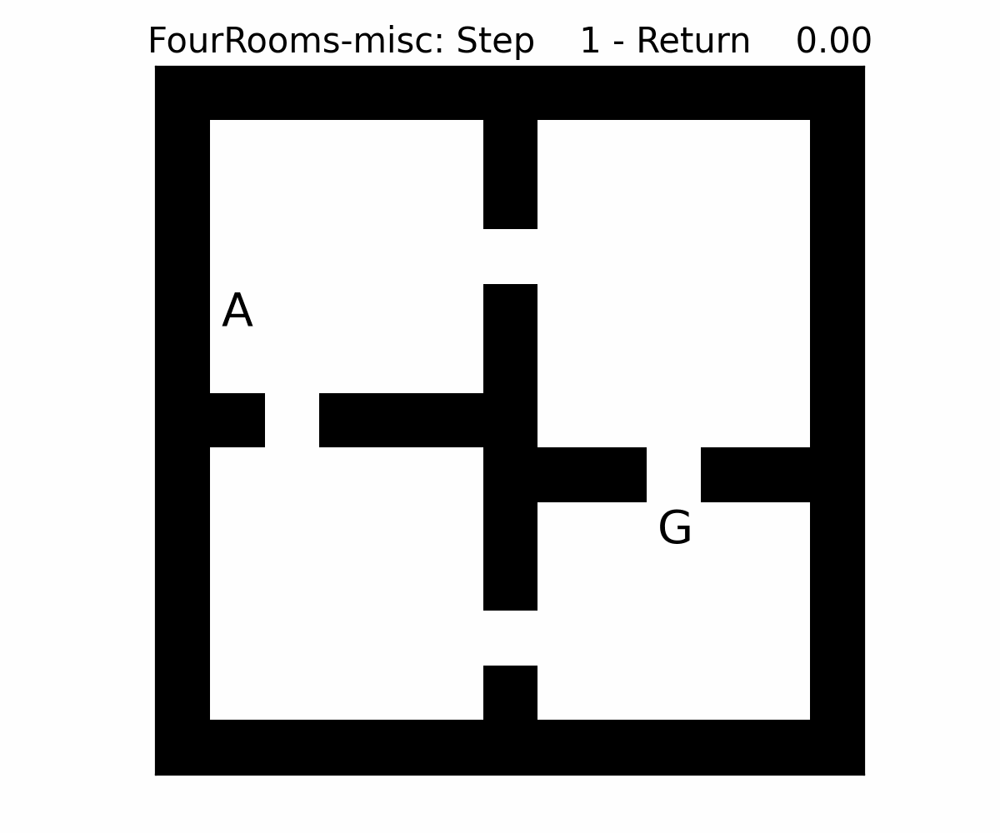

# Training & Speed Evaluation Tools for [`gymnax`](https://github.com/RobertTLange/gymnax)

<a href="https://github.com/RobertTLange/gymnax-blines/blob/main/docs/logo.png?raw=true"></a>


In this repository we provide training pipelines for [`gymnax`](https://github.com/RobertTLange/gymnax) agents in JAX. Furthermore, you can use the utilities to speed benchmark step transitions.

## Accelerated Training of Agents with [`gymnax`](https://github.com/RobertTLange/gymnax)

We provide training routines and the corresponding checkpoints for both Evolution Strategies (mostly OpenES using [`evosax`](https://github.com/RobertTLange/evosax) and PPO. You can train the agents as follows: 

```
python train.py -config configs/<env_name>/ppo.yaml
python train.py -config configs/<env_name>/es.yaml
```

## Visualize [`gymnax`](https://github.com/RobertTLange/gymnax) Environment Rollouts

You can also generate GIF visualizations of the agent's behaviour as follows:

```
python visualize.py -env <env_name>
```

Note that we do not support visualizations for most behavior suite environments, since they do not lend themselves to visual display (e.g. markov reward process, etc.).

|  |  |  |  | 
| --- | --- | --- | --- |
|  |   |  |  |
|  |   |  |  |

## Speed Up Evaluations for [`gymnax`](https://github.com/RobertTLange/gymnax)

Finally, we provide simple tools for benchmarking the speed of step transitions on different hardware (CPU, GPU, TPU). For a specific environment the speed estimates can be obtained as follows:

```
python speed.py -env <env_name>
```

For each environment we estimate the milliseconds required to execute 1 Mio steps on various hardware and for both random/neural network policies. We report the mean over 10 independent runs:

| Environment Name | `np` <br /> CPU <br /> 1 Env | `jax` <br /> CPU <br /> 1 Env | `np` <br /> CPU <br /> 20 Envs | `jax` <br /> CPU <br /> 20 Envs | `jax` <br /> RTX 2080Ti <br /> 5k Envs | `jax` <br /> V100s <br /> 10k Envs |
| --- | --- | --- | --- | --- | --- | --- |
| [`Pendulum-v1`](https://github.com/RobertTLange/gymnax/blob/main/gymnax/environments/classic_control/pendulum.py) | 
| [`CartPole-v1`](https://github.com/RobertTLange/gymnax/blob/main/gymnax/environments/classic_control/cartpole.py) | 
| [`MountainCar-v0`](https://github.com/RobertTLange/gymnax/blob/main/gymnax/environments/classic_control/mountain_car.py) |
| [`MountainCarContinuous-v0`](https://github.com/RobertTLange/gymnax/blob/main/gymnax/environments/classic_control/continuous_mountain_car.py) | 
| [`Acrobot-v1`](https://github.com/RobertTLange/gymnax/blob/main/gymnax/environments/classic_control/acrobot.py) |
| --- | --- | --- | --- | ---| --- | --- |
| [`Catch-bsuite`](https://github.com/RobertTLange/gymnax/blob/main/gymnax/environments/bsuite/catch.py) |
| [`DeepSea-bsuite`](https://github.com/RobertTLange/gymnax/blob/main/gymnax/environments/bsuite/deep_sea.py) |
| [`MemoryChain-bsuite`](https://github.com/RobertTLange/gymnax/blob/main/gymnax/environments/bsuite/memory_chain.py) |
| [`UmbrellaChain-bsuite`](https://github.com/RobertTLange/gymnax/blob/main/gymnax/environments/bsuite/umbrella_chain.py) |
| [`DiscountingChain-bsuite`](https://github.com/RobertTLange/gymnax/blob/main/gymnax/environments/bsuite/discounting_chain.py) |
| [`MNISTBandit-bsuite`](https://github.com/RobertTLange/gymnax/blob/main/gymnax/environments/bsuite/mnist.py) |
| [`SimpleBandit-bsuite`](https://github.com/RobertTLange/gymnax/blob/main/gymnax/environments/bsuite/bandit.py) |
| --- | --- | --- | --- | ---| --- | --- |
| [`Asterix-MinAtar`](https://github.com/RobertTLange/gymnax/blob/main/gymnax/environments/minatar/asterix.py) |
| [`Breakout-MinAtar`](https://github.com/RobertTLange/gymnax/blob/main/gymnax/environments/minatar/breakout.py) |
| [`Freeway-MinAtar`](https://github.com/RobertTLange/gymnax/blob/main/gymnax/environments/minatar/freeway.py) |
| [`Seaquest-MinAtar`](https://github.com/RobertTLange/gymnax/blob/main/gymnax/environments/minatar/seaquest.py) |
| [`SpaceInvaders-MinAtar`](https://github.com/RobertTLange/gymnax/blob/main/gymnax/environments/minatar/space_invaders.py) |
| --- | --- | --- | --- | ---| --- | --- |
| [`FourRooms-misc`](https://github.com/RobertTLange/gymnax/blob/main/gymnax/environments/misc/rooms.py) |
| [`MetaMaze-misc`](https://github.com/RobertTLange/gymnax/blob/main/gymnax/environments/misc/meta_maze.py) |
| [`PointRobot-misc`](https://github.com/RobertTLange/gymnax/blob/main/gymnax/environments/misc/point_robot.py) |
| [`BernoulliBandit-misc`](https://github.com/RobertTLange/gymnax/blob/main/gymnax/environments/misc/bernoulli_bandit.py) |
| [`GaussianBandit-misc`](https://github.com/RobertTLange/gymnax/blob/main/gymnax/environments/misc/gaussian_bandit.py) |

TPU comparisons will follow once I (or you?) find the time.

## Running Grid Search with the `MLE-Infrastructure`

```
pip install mle-toolbox
mle run ...
```

## MinAtar Comparison with Torch DQN

In order to make sure that we fully replicate the world dynamics of the NumPy based MinAtar API, we provide different checks:

- Transition test assertions from random and trained behaviour.
- Performance test from DQN agents trained on the NumPy environment in the JAX environment.
- Performance test from DQN agents trained on the JAX environment in the NumPy environment.

We first replicate train the DQN agents using the code provided in the MinAtar repository without any parameter tuning. E.g.

```
cd examples
python dqn.py -g breakout -v -s
```